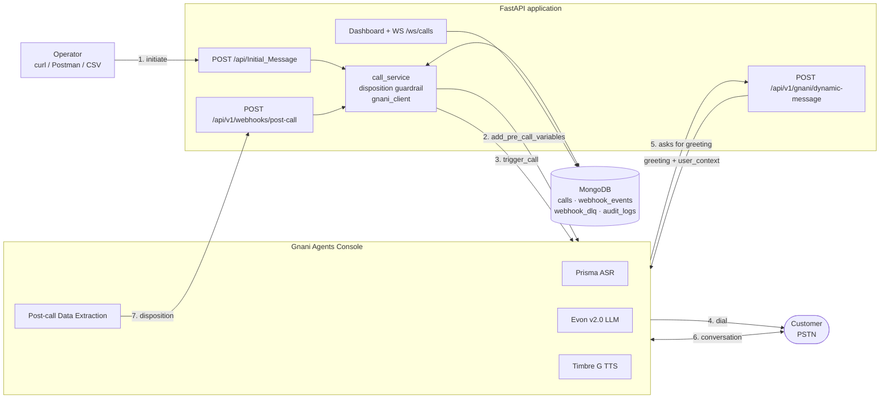

# EMI Collection Voice Agent — Gnani Agents Console + FastAPI

An outbound AI voice agent for EMI (loan instalment) payment collection, built on the
Gnani Agents Console with a Python FastAPI backend, structured disposition capture and
a call-outcome dashboard.

- [1. What this does](#1-what-this-does)
- [2. Architecture](#2-architecture)
- [3. Quick start](#3-quick-start)
- [4. API reference](#4-api-reference)
- [5. Configuration](#5-configuration)
- [6. Design decisions and why](#6-design-decisions-and-why)
- [7. Platform findings — undocumented behaviour we had to discover](#7-platform-findings--undocumented-behaviour-we-had-to-discover)
- [8. Bugs found by live testing, and their fixes](#8-bugs-found-by-live-testing-and-their-fixes)
- [9. Ambiguities and contradictions in the specification](#9-ambiguities-and-contradictions-in-the-specification)
- [10. Known limitations and blockers](#10-known-limitations-and-blockers)
- [11. Testing](#11-testing)
- [12. Assignment compliance map](#12-assignment-compliance-map)
- [13. Production readiness](#13-production-readiness)

---

## 1. What this does

A collections agent calls a customer about an overdue instalment, holds a multi-turn
conversation in English (US) or Spanish, determines the customer's payment intent from
their **explicit statements**, and records a structured disposition.

The conversation is deliberately not a question-and-answer script. It is a ten-stage
machine with a slot ledger, so the agent never re-asks something already answered and
never discloses account details before confirming identity.

**Business scenarios handled:** promise to pay (today / tomorrow / future / partial),
already paid, callback requested, refusal (financial / medical / no reason), dispute
(amount, charges, no such loan), wrong number, third party, busy, no response,
voicemail, disconnected, and genuinely unclear.

---

## 2. Architecture



**The critical path is step 5.** The trigger response contains no call or conversation
identifier, so the Dynamic Messages callback is the *only* point at which Gnani tells us
a `conversation_id` for a call we started. That callback is therefore both the greeting
provider and the correlation mechanism for step 7.

### Layout

```
app/
  main.py                    app factory, middleware, exception handlers, WebSocket
  config.py                  pydantic-settings, environment-driven
  models/enums.py            19 stage codes, call statuses, languages
  models/schemas.py          Pydantic request/response contracts
  routers/                   calls · gnani · webhooks · health · deps
  services/
    call_service.py          lifecycle orchestration, correlation, idempotency
    disposition.py           stage-code guardrail + spoken-date resolution
    gnani_client.py          two-step trigger, retry, timeout
    greeting.py              bilingual identity-gated greeting
    metrics.py               dashboard summary-card groupings
  db/repository.py           Mongo + JSON backends behind one protocol
  utils/                     logging (structlog) · masking · phone correlation
  ws/hub.py                  WebSocket fan-out
gnani/                       system prompt, extraction config, flow config
tests/mock_gnani/            stand-in for the Agents Console
```

---

## 3. Quick start

The full call lifecycle runs locally with **no Gnani account and no credits**, against
`tests/mock_gnani`, which mirrors the real API shapes captured from the console.

```bash
python -m venv .venv
.venv/Scripts/python -m pip install -r requirements-dev.txt   # Windows
cp .env.example .env        # then set WEBHOOK_API_KEY
```

Two terminals:

```bash
# 1 — the application
uvicorn app.main:app --port 8000

# 2 — the mock Agents Console
WEBHOOK_API_KEY=<same as .env> APP_BASE_URL=http://127.0.0.1:8000 \
  uvicorn tests.mock_gnani.main:app --port 9100
```

Drive a call:

```bash
curl -X POST http://127.0.0.1:8000/api/Initial_Message \
  -H "Content-Type: application/json" \
  -d '{"customer_id":"CUST001","customer_name":"Rahul Sharma",
       "phone_number":"9123456789","country_code":"+91",
       "loan_account_number":"LAN123456","emi_amount":12500,
       "emi_due_date":"2026-07-30","preferred_language":"en-US","currency":"INR"}'
```

Returns `202` with a `call_id`. The mock then calls back for the greeting, waits, and
posts a disposition — so within a few seconds the record reaches `COMPLETED` with a
stage code. Swagger is at `/docs`.

To run against the real platform, set `GNANI_BASE_URL=https://api.inya.ai` and
`GNANI_AGENT_ID`, and expose this service via a tunnel (Gnani cannot reach `localhost`).

### With Docker

```bash
docker compose --profile mock up --build   # api + mongo + mock console
python -m scripts.seed_scenarios           # populate the dashboard
```

Drop `--profile mock` to run api + mongo only. The dashboard is on
`http://localhost:8000`.

### Deliverables

| Path | Contents |
|---|---|
| `docs/demo_script.md` | The ten section 12 demonstration steps as a runbook |
| `docs/stage_code_accuracy.md` | Generated accuracy report |
| `postman_collection.json` | 17 requests across 6 folders, with assertions |
| `gnani/` | System prompt, extraction config, conversation-flow config |
| `samples/bulk_calls.csv` | CSV for the bulk-upload endpoint |

---

## 4. API reference

| Method | Path | Purpose |
|---|---|---|
| `POST` | `/api/Initial_Message` | §5.1 — validate, persist, trigger. `202` |
| `POST` | `/api/v1/gnani/dynamic-message` | §5.2 — Gnani asks us for the opening message |
| `POST` | `/api/v1/webhooks/post-call` | §5.3 — disposition intake. Requires `X-Webhook-Key` |
| `GET` | `/health` · `/ready` | Liveness · readiness (storage ping) |
| `WS` | `/ws/calls` | Live dashboard updates |

Status codes: `202` accepted · `401` bad webhook key · `422` validation failure ·
`502` Gnani rejected/unreachable · `504` Gnani timeout · `200 duplicate_ignored` ·
`202 unmatched` (dead-lettered).

---

## 5. Configuration

Every value is environment-driven; `.env.example` documents the full set and `.env` is
git-ignored. No secrets are committed.

Notable variables:

| Variable | Why it matters |
|---|---|
| `TIMEZONE` | **Must match the agent's Time Zone in the console.** "today"/"tomorrow" are resolved against it; a mismatch puts every PTP date off by a day |
| `GNANI_TRIGGER_PATH` | Undocumented endpoint, kept configurable so it can change without a code edit |
| `STORAGE_BACKEND` | `mongo` (default) or `json` |
| `WEBHOOK_API_KEY` | Shared secret; **auth fails closed** if unset |
| `CURRENCY` | Mapped to a spoken word before reaching TTS — never sent as an ISO code |

---

## 6. Design decisions and why

### 6.1 The greeting withholds the amount until identity is confirmed

§5.2 requires that *"sensitive information should not be disclosed until the customer's
identity has been reasonably confirmed."* We implement a two-stage disclosure:
`build_greeting()` names only the lender and the account's last four digits;
`build_disclosure()` holds the amount and due date until `identity_confirmed = yes`.

This **deliberately deviates from the worked example** in §5.2, which states the amount
before asking to confirm identity. We followed the stated rule because it is also how
collections must legally work — you cannot disclose a debt to whoever happens to answer
a phone. If a third party answers, the agent reveals nothing at all.

### 6.2 `ptp_date` is extracted as a string, never a date

The console offers `Boolean / String / Number / Enum` — no Date type. But even with one,
String is correct here. Customers say *"the thirtieth"*, not `2026-07-30`, and forcing
the model to resolve that is exactly what failed in live testing (§8.1).

So the extraction field passes the **raw spoken phrase** through, and
`resolve_ptp_date()` resolves it in code against the real call date in the configured
timezone. Deterministic logic instead of a model guess.

### 6.3 The disposition guardrail can overrule the model

`services/disposition.py` re-validates every disposition:

- an unrecognised code becomes `UNCLEAR`
- a `PTP_*` code with no resolvable date becomes `UNCLEAR` — *a promise with no date is not a promise*
- a date in the past, or beyond `MAX_PTP_DAYS_AHEAD`, becomes `UNCLEAR`
- `PTP_TODAY` / `PTP_TOMORROW` are **reclassified** if the resolved date disagrees

Every change is recorded in `disposition_adjustments` and surfaced on the dashboard, so
a downgrade is visible rather than silent. This is how §2's *"must not assign a
disposition based on assumptions"* is enforced — an LLM asked for a stage code will
always return one, so refusal has to live in code.

Observed in practice: the model returned `PTP_FUTURE` for *"the thirtieth"*; the server
resolved the date, saw it was tomorrow, and stored `PTP_TOMORROW` with the reason.

### 6.4 Stage 9 of the conversation exists to make the disposition defensible

The agent reads the outcome back and waits for an explicit yes. This is not politeness —
it manufactures the explicit customer statement the disposition must rest on.
Conversation design and disposition accuracy are the same problem: **without the
readback, the extraction is inferring.**

### 6.5 Correlation uses a phone suffix, not an exact match

The console is inconsistent about phone format — the trigger takes `phone` (national)
and `countryCode` separately, while the Dynamic Messages callback sends a single
`mobile` whose format is undocumented (the docs' own example carries no country code).

Every record therefore stores `phone_suffix`, the trailing 9 national digits, so
`9123456789`, `+919123456789` and `0919123456789` all collapse to one key. Found the
hard way — see §8.4.

### 6.6 Variables + trigger are serialised behind a lock

`add_pre_call_variables` is keyed to the **bot**, not to a call, and the trigger returns
no identifier. Two overlapping calls on one agent would therefore clobber each other's
variables. `CallService._trigger_lock` makes the pair a single critical section.

This is a genuine platform constraint, not a design preference: **concurrent calls to
one agent are unsafe by construction.** Scaling out requires either one agent per worker
or per-call variable scoping from Gnani.

### 6.7 The webhook stores the raw body before validating

The Agents Console offers no body mapping for the post-call trigger — only method, URL
and headers — so the payload shape is Gnani's to choose, not ours. The handler therefore
reads and stores the raw body first, returns quickly, and only then parses. A payload we
did not anticipate is captured for inspection rather than rejected.

`PostCallWebhookPayload` also accepts `DISPOSITION`, `disposition`, `stage_code` and
`STAGE_CODE` via alias, because the platform and its documentation disagree (§7.3).

### 6.8 A duplicate returns `200`, never `409`

§5.3 requires duplicate deliveries to be absorbed. Returning a non-2xx would invite
another retry and *manufacture* the duplicates we are being asked to prevent. So a
replay returns `200 {"status":"duplicate_ignored"}`.

Idempotency is enforced by a **unique index** on `webhook_events.event_id`; the
application-level check is an optimisation, not the guarantee. When Gnani supplies no
event id, one is derived as a SHA-256 of the canonicalised payload.

### 6.9 Unmatched events are dead-lettered, not dropped

An unknown `conversation_id` is written to `webhook_dlq` with the raw body and a reason,
and answered `202`. *"We store what we cannot match"* is a better answer than a silent
404 — and a retry cannot fix an unmatched event, so a non-2xx would only cause a storm.

### 6.10 Two storage backends behind one protocol

MongoDB is the default (§7 prefers it). A JSON-file backend, selected with
`STORAGE_BACKEND=json`, is also supported — §7 permits it, and it means the entire loop
is demonstrable with no infrastructure, which doubles as a demo safety net.

### 6.11 The system prompt is ordered for prompt caching

The console's Prompt Efficiency analyser flagged the first draft: *"This prompt defeats
KV cache. Restructure to maximise static prefix."* Dynamic variables appeared at line 11
of 98, so nothing after them could be cached across calls.

Restructured so all instructions come first and **all** variables sit in one trailing
`CUSTOMER CONTEXT` block:

| Metric | Before | After |
|---|---|---|
| First variable | line 11 of 98 | line 74 of 82 |
| Cacheable static prefix | ~10% | **89%** |
| Blank-line ratio | 30.6% | 10.8% |

The stage machine now refers to *"the borrower named in CUSTOMER CONTEXT"* rather than
inlining `{{ customer_name }}`. Same behaviour, materially lower per-call latency and
token cost.

### 6.12 `Enum` is used wherever the answer is from a closed set

`DISPOSITION`, `language_captured` and `customer_sentiment` are Enum-typed in the
console, which makes an invalid value structurally impossible rather than merely
discouraged. `partial_amount` stays String despite being numeric — it must be able to
return **empty**, and an empty Number risks coercion to `0`, which would read as a real
commitment of zero.

---

## 7. Platform findings — undocumented behaviour we had to discover

### 7.1 The Agents Console API is undocumented

Neither the public docs nor the console expose an outbound call-trigger API. The
documentation site covers only STT/TTS/Voice-Cloning on `api.vachana.ai`. The endpoints
below were recovered by inspecting the console's own network traffic:

```http
POST https://api.inya.ai/analytics/add_pre_call_variables
{ "botId": "<bot_id>", "preCallVariables": { ... } }

POST https://api.inya.ai/genbots/trigger_call/v3/<bot_id>?environment=production
{ "phone": "9123456789", "name": "Gouti-India", "countryCode": "+91" }
```

Findings: the flow is **two requests, not one**; `agentId` and `bot_id` are the same
value; and the trigger takes the national number and country code as separate fields.

### 7.2 The trigger returns no correlation identifier

```json
{"status":"success","message":"Call is being triggered to 9123456789","response":{"data":null}}
```

`data: null`, and the request body has no field for a reference id of our own. This is
why correlation depends on the Dynamic Messages callback (§6.5).

### 7.3 `DISPOSITION` is a reserved field name

Naming the disposition extraction field `stage_code` makes the **entire bot config**
fail to save:

```json
{"status":"failure","message":"A DISPOSITION field is required with enum type and with valid options."}
```

The documentation's own example (`C01_Disposition`) uses `STAGE_CODE`. Documentation
drift — the field must be named `DISPOSITION`.

### 7.4 Two separate API surfaces, easily conflated

| | Gnani APIs | Gnani Agents |
|---|---|---|
| Host | `api.vachana.ai` | `api.inya.ai` |
| Auth | `X-API-Key-ID`, per-scope keys | console session |
| Covers | STT, TTS, Voice Cloning | agents, calls, analytics |
| Documented | yes | **no** |

The API-key page issues only STT- and TTS-scoped keys. **Neither authenticates against
the Agents Console.**

### 7.5 The disposition prompt structure differs from the docs

`C01_Disposition` describes a single nine-section prompt returning JSON. The console
instead provides **Base Instructions + typed Data Fields** with per-field extraction
instructions and a Test Extraction button. The console approach is stronger — Enum
constrains output at the platform level — so we built for it and kept the prose version
as documented stage-code logic.

### 7.6 The transcript does not label speakers unambiguously

Turns appear as the agent's name (`EMI Payment Collection`) versus `You`. Since the
extraction rules depend on *"rely only on the customer's words"*, the Base Instructions
include an explicit PARTICIPANTS section defining who is who, with a fallback rule: the
party asking about payment is the agent.

---

## 8. Bugs found by live testing, and their fixes

Each of these was found by running the system, not by reading the code.

### 8.1 The agent did not know today's date

Live transcript:

```
Customer: i can pay on the thirtieth
Agent:    did you mean you will pay today, the thirtieth of July?
Customer: today is not thirty yet today is twenty ninth
```

An LLM has no clock. Since every PTP code is an offset from today, this made the
disposition guesswork. **Fix:** `current_date` / `current_date_spoken` added to the
pre-call variables, plus an explicit stage-5 date rule — a bare day number never means
today unless it equals today's date, and dates are read back with the weekday
(*"Thursday the thirtieth"*) so a misunderstanding surfaces in one turn.

### 8.2 TTS spelled out currency and abbreviations

The agent said *"Your **E M I** of **U S D** 1,200"* — letter by letter. **Fix:**
currency codes are mapped to spoken words before reaching TTS (`INR` → "rupees" /
"rupias"), the word follows the amount rather than preceding it, and "EMI" became
"monthly instalment". A prompt rule forbids speaking any code or abbreviation aloud.

### 8.3 The agent could not identify the caller

Asked *"who is this?"*, it answered *"I am calling from the lender"* — no lender named,
which is both unconvincing and wrong for collections. **Fix:** `lender_name` added as a
variable and surfaced in the greeting.

### 8.4 Correlation failed on phone-number format

The Dynamic Messages callback sends `mobile` in national format (`9123456789`) while we
stored E.164 (`+919123456789`). Exact matching failed, the conversation was never bound,
and the post-call webhook was dead-lettered as unmatched. **Fix:** `phone_suffix`
correlation key (§6.5).

### 8.5 Spoken ordinal dates were unparseable

`resolve_ptp_date("the thirtieth")` returned `None`, so a legitimate commitment was
downgraded to `UNCLEAR`. The guardrail behaved correctly but was rejecting real
promises — and *"the thirtieth"* is precisely how the customer phrased it. **Fix:**
English ordinals (`the thirtieth`), numeric ordinals (`30th`) and Spanish cardinals
(`el treinta`) now resolve, with next-occurrence logic (this month, else next) and
invalid-date guarding (the 31st of a 30-day month).

### 8.6 `tzdata` missing

`ZoneInfo("America/New_York")` raised `ZoneInfoNotFoundError` — Windows ships no IANA
database, and neither do slim Linux images. Would have failed identically in Docker.
**Fix:** `tzdata` pinned in `requirements.txt`.

### 8.7 Python 3.14 dependency incompatibility

`pydantic-core` has no `cp314` wheel below 2.12, and the source build fails because
PyO3 ≤ 0.22 supports 3.13 at most. **Fix:** version floors chosen for 3.14 wheel
availability, documented inline so nobody lowers them.

---

## 9. Ambiguities and contradictions in the specification

Documented rather than silently resolved.

### 9.1 §5.2 contradicts its own example

The rule says withhold sensitive information until identity is confirmed; the example
immediately below discloses the amount and due date before asking to confirm identity.
We followed the rule (§6.1).

### 9.2 §3.1 and §3.3 are mutually incompatible

§3.1 mandates **Timbre 2.5**. §3.3 mandates **English (US) and Spanish**. But Gnani's
TTS documentation lists `timbre-v2.5` as supporting ten **Indian** languages only —
`hi-IN, en-IN, ta-IN, te-IN, kn-IN, ml-IN, mr-IN, pa-IN, bn-IN, gu-IN` — with **no
Spanish and no `en-US`**. Its 41 voices are Hindi, Tamil, Bengali, Gujarati, Marathi,
Kannada, Punjabi, Telugu, Malayalam and Hinglish.

Timbre 2.5 is therefore technically unsuitable for this use case, and is in any case not
provisioned for this account. The agent uses **Gnani Timbre G v1.0**, whose voice
catalogue (Elena, Lucia) supports the required languages. Screenshot evidence of the
model dropdown offering exactly one option is included.

### 9.3 The assignment appears adapted from an Indian use case

§3.3 asks for English (US) and Spanish, but the §5.1 sample payload uses
`"country_code": "+91"`, `"preferred_language": "Hindi"`, `LAN123456` and `12500` — and
§3.1's Timbre 2.5 requirement only makes sense for Indian languages. This is consistent
with a Hindi/Indian-English original.

We implement §3.3 as written (EN-US + Spanish) since it is the explicit language
requirement, while using INR to stay coherent with the Indian test number.

### 9.4 Stage-code naming

§3.4 and the docs use `STAGE_CODE`; the console requires `DISPOSITION` (§7.3). Both are
accepted by the webhook model.

---

## 10. Known limitations and blockers

### 10.1 Outbound PSTN calls are never delivered — unresolved

Both API calls succeed:

```
POST /analytics/add_pre_call_variables            → 200
POST /genbots/trigger_call/v3/<bot>?environment=production
  → 200 {"status":"success","message":"Call is being triggered to 9123456789"}
```

**No call arrives**, at either whitelisted number. Since the API reports success, the
failure is downstream of the Agents Console — telephony delivery, account entitlement,
or carrier. Candidate causes, in order of likelihood:

1. **No outbound caller number provisioned.** The console exposes *Inbound Numbers*
   only; whitelisting authorises a destination but does not supply an origin.
2. **Plan/credit limits.** `user_info` reports `totalCredit: 20.0`. Web-based voice
   works (no telephony); PSTN does not.
3. **Indian DND registry** blocking automated calls to the `+91` number.

Escalated to Gnani with the conversation id and request/response evidence. This blocks
the §15 acceptance line *"the customer receives a call"* and weakens the runtime
evidence for §3.1 — but it is an account-side issue, not a code defect. Everything
downstream of the trigger is exercised via `tests/mock_gnani`.

### 10.2 Whitelisting OTP does not reach US numbers

`+1 878…` received no OTP and shows 0 test calls; `+91…` received one and verified.
Gnani's SMS route appears to be India-only. Consequence: **all live testing must use the
Indian number**, which is why sample recordings dial `+91`.

### 10.3 Timbre 2.5 is unavailable and unsuitable

See §9.2. The console offers only Timbre G v1.0 for this account, and 2.5 could not
serve Spanish even if provisioned.

### 10.4 Concurrent calls on one agent are unsafe

Pre-call variables are bot-scoped (§6.6). Mitigated with a lock, which serialises
throughput. A production deployment needs per-call variable scoping or one agent per
concurrent stream.

### 10.5 Credit ceiling

20 credits total. Conversation iteration was therefore done in the text Chat Window
rather than voice, and voice calls reserved for evidence capture.

---

## 11. Testing

```bash
pytest                                    # 129 tests
python -m tests.test_disposition_accuracy # accuracy report
python -m scripts.seed_scenarios          # drive all 10 scenarios + 3 failure paths
ruff check . && mypy app                  # lint and types
```

| Suite | Tests | Covers |
|---|---|---|
| `test_disposition.py` | 51 | Guardrail rules, spoken-date resolution |
| `test_masking_and_phone.py` | 40 | Section 6.1 masking, phone-format correlation |
| `test_greeting.py` | 25 | Identity gate, TTS safety, variable completeness |
| `test_webhook_lifecycle.py` | 23 | Sections 5.1–5.3, idempotency, ordering |
| `test_gnani_client.py` | 10 | Retry policy, timeout, real payload shapes |
| `test_disposition_accuracy.py` | 5 | Labelled corpus + confusion matrix |

### Stage-code accuracy

`tests/fixtures/disposition_cases.json` holds 27 labelled cases; the harness runs them
through the real guardrail and writes `docs/stage_code_accuracy.md`.

**Accuracy: 100% (27/27). Nine cases required the guardrail to override the model, and
all nine were handled correctly.** The second number is the meaningful one — a corpus
where nothing gets corrected proves nothing, so a test asserts the corpus contains at
least eight correction cases.

Corrections exercised include: `PTP_FUTURE` + *"the thirtieth"* → `PTP_TOMORROW`;
`PTP_FUTURE` + *"as soon as I can"* → `UNCLEAR`; an invented code → `UNCLEAR`; a date
already past → `UNCLEAR`; Spanish `el treinta` resolved then reconciled.

**Scope, stated precisely.** This measures the *server-side guardrail*: given what the
extraction model reported, does the system store the correct disposition? Model-side
extraction quality is validated separately with the console's Test Extraction tool
against the table in `gnani/postcall_extraction_config.md`.

There is also a cross-corpus invariant: **no case can store a `PTP_*` code without a
resolved date.** That is section 2's core requirement as a property, not a per-case
assertion.

### Scenarios

`scripts/seed_scenarios.py` drives all ten conversation outcomes plus the three failure
paths **through the real code path** — `POST /api/Initial_Message`, the greeting
callback, then the webhook. Nothing is written to storage directly, so what appears on
the dashboard has been through the same code a live call would use.

`tests/mock_gnani` drives the scenarios that cannot be produced on demand — the
deterministic failure paths and the ten conversation outcomes — by mirroring the real
API shapes and then performing the callbacks the platform would.

### Verified end to end

| Scenario | Result |
|---|---|
| §5.1 initiation | `202`, masked phone, identity-gated greeting |
| §5.2 Dynamic Messages | `conversation_id` bound to `call_id` |
| §5.3 disposition intake | `COMPLETED`, `PTP_TOMORROW`, `ptp_date` resolved, transcript stored |
| §9.10 duplicate webhook | `200 duplicate_ignored`, no second record |
| §9.11 invalid request | `422` on empty id, malformed phone, negative amount |
| Webhook auth | `401` without or with a wrong key; fails closed if unset |
| Unmatched event | `202`, written to `webhook_dlq` |
| Guardrail | `PTP_FUTURE` + "the thirtieth" → `PTP_TOMORROW` with recorded reason; "I'll try next month" → `UNCLEAR` |

---

## 12. Assignment compliance map

| § | Requirement | Status |
|---|---|---|
| 3.1 | Prisma ASR, Timbre TTS, Evon LLM | Configured — Timbre G v1.0, see §9.2 |
| 3.2 | Multi-turn conversation | 10-stage machine + slot ledger |
| 3.3 | English (US) + Spanish | Configured, with language-switch prompt |
| 3.4 | 19 stage codes | Enum in code and in the console |
| 4 | Structured disposition | Base Instructions + 7 typed extraction fields |
| 5.1 | Initial Message API | `POST /api/Initial_Message` |
| 5.2 | Dynamic initial message | Identity-gated, bilingual, TTS-safe |
| 5.3 | Post-call webhook | Auth, idempotency, DLQ, ordering guard |
| 7 | Data storage | MongoDB (preferred) + JSON backend |
| 6 | Dashboard | 13 columns, 11 detail fields, 7 filters, 8 cards |
| 8 | Technical expectations | All 13 items |
| 9 | 12 mandatory scenarios | 10 conversation outcomes + 3 failure paths, all driven by `scripts/seed_scenarios.py` |
| 14 | Bonus | Docker, WebSocket live updates, analytics chart, CSV bulk upload, PII masking, audit logs |
| 15 | Customer receives a call | **Blocked — see §10.1** |

---

## 13. Production readiness

**Immediate gaps.** Concurrency is capped by the bot-scoped variable constraint (§10.4).
Secrets belong in a managed store rather than `.env`. The JSON backend is single-writer
and exists for demonstration only.

**Scaling.** The API is stateless and scales horizontally behind a load balancer. The
webhook should hand off to a queue so intake stays fast and enrichment retries
independently. MongoDB needs a replica set; the unique index on `event_id` already makes
idempotency correct under concurrent delivery.

**Operations.** Structured JSON logs carry `call_id`, `conversation_id` and
`request_id` on every line. `webhook_dlq` depth is the key alert — a rising DLQ means
correlation is failing. `audit_logs` gives a per-call state-transition trail.

**Product.** Retry scheduling for `RNR` / `BUSY` / `VM`, PTP-date follow-up reminders,
per-tenant rate limits, and agent-level A/B testing of the conversation prompt.
