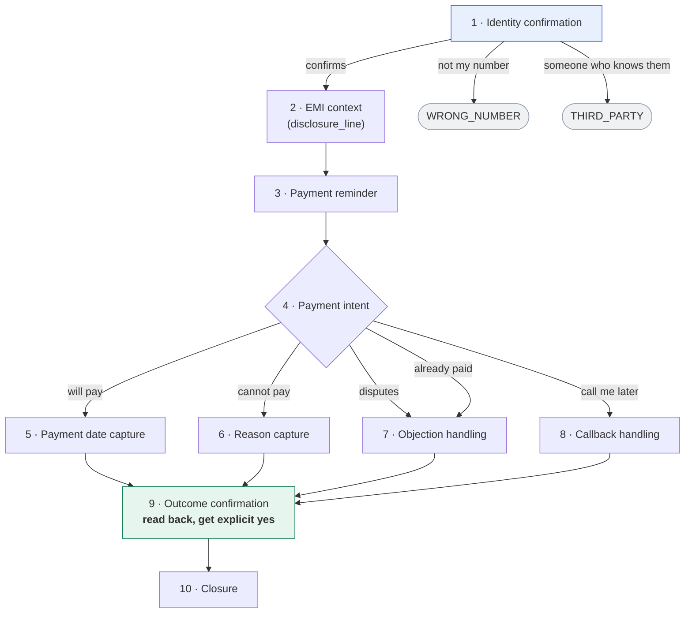

# Conversation flow

Submission item 3. The prompt itself is `gnani/system_prompt.md`; this describes
the flow it encodes and why it is shaped this way.

---

## 1. Why a state machine and not a script

Assignment section 3.2 asks for "a multi-turn conversation rather than a fixed
question-and-answer flow", and requires that the bot "should remember
information already provided by the customer and should not repeatedly ask the
same question."

A free-form prompt fails both. It drifts off the ten required stages, and with
no explicit memory it re-asks whatever the model's attention lost. So the prompt
encodes two things: an ordered **stage machine**, and a **slot ledger** the model
maintains and consults before it asks anything.

The ledger is the anti-repetition mechanism. The standing rule is:

> Before asking anything, check the ledger. If a slot already has a value, do
> not ask for it again — reference it instead.

---

## 2. Slot ledger

| Slot | Values | Set at stage |
|---|---|---|
| `identity_confirmed` | yes / no / third_party / wrong_number | 1 |
| `language` | English / Spanish | any |
| `context_delivered` | true / false | 2 |
| `payment_intent` | pay_today / pay_future / partial / already_paid / cannot_pay / dispute / refuse / callback / none | 4 |
| `ptp_date` | the date the customer stated | 5 |
| `partial_amount` | amount, if less than the full instalment | 5 |
| `inability_reason` | financial / medical / other | 6 |
| `dispute_type` | already_paid / charges / no_loan | 7 |
| `callback_time` | specific time the customer gave | 8 |
| `outcome_confirmed` | true / false | 9 |

---

## 3. Stage machine

**Stages 2 and 3 are gated by stage 1.** Nothing about the debt is spoken until
identity is confirmed.

---

## 4. Stage 9 is the keystone

The agent reads the outcome back and waits for an explicit yes:

> "So I'll note that you'll pay twelve thousand five hundred rupees on the fifth
> of August. Is that correct?"

This is not politeness. Section 2 requires that the final stage code rest on
"explicit statements made by the customer" — and stage 9 is what manufactures
that statement. Without it, the extraction is inferring intent from an
unconfirmed aside.

It is observable in a real call. The captured disposition reads:

> *The customer said, "is it possible to pay on fifth august" and confirmed with
> "yes" when the payment date was read back.*

Conversation design and disposition accuracy are the same problem.

---

## 5. Branch matrix

Every scenario in section 2, and where it lands.

| Customer says | Branch | Slots set | Stage code |
|---|---|---|---|
| "I'll pay today" | 4 → 5 → 9 | `payment_intent=pay_today`, `ptp_date` | `PTP_TODAY` |
| "I'll pay tomorrow" | 4 → 5 → 9 | `ptp_date` | `PTP_TOMORROW` |
| "I'll pay on the 5th" | 4 → 5 → 9 | `ptp_date` | `PTP_FUTURE` |
| "I can manage 5,000" | 4 → 5 → 9 | `partial_amount` | `PTP_PARTIAL` |
| "I already paid" | 4 → 7 → 9 | `payment_intent=already_paid` | `ALREADY_PAID` |
| "I paid, why do you say I owe" | 4 → 7 → 9 | `dispute_type=already_paid` | `DISPUTE_PAID` |
| "The amount is wrong" | 4 → 7 → 9 | `dispute_type=charges` | `DISPUTE_CHARGES` |
| "I never took this loan" | 4 → 7 → 9 | `dispute_type=no_loan` | `NO_LOAN` |
| "Call me Thursday at 4" | 4 → 8 → 9 | `callback_time` | `CALLBACK_SCHEDULED` |
| "Call me later" | 4 → 8 | *(no time captured)* | `BUSY` |
| "I lost my job" | 4 → 6 → 9 | `inability_reason=financial` | `RTP_FINANCIAL` |
| "I've been in hospital" | 4 → 6 → 9 | `inability_reason=medical` | `RTP_MEDICAL` |
| "I'm not paying" | 4 → 7 → 9 | `payment_intent=refuse` | `RTP_NO_REASON` |
| "This is his brother" | 1 → close | `identity_confirmed=third_party` | `THIRD_PARTY` |
| "Wrong number" | 1 → close | `identity_confirmed=wrong_number` | `WRONG_NUMBER` |
| *(silence)* | 1 | — | `RNR` |
| *(voicemail)* | — | — | `VM` |
| *(drops mid-call)* | any | partial | `DSCN` |
| "I'll try next month" | 4 → 6 | `payment_intent=cannot_pay` | **`UNCLEAR`** |

That last row is deliberate. "I'll try" carries intent but no specificity, so it
is not a commitment. If the extraction reports `PTP_FUTURE` anyway, the
server-side guardrail refuses it — see `app/services/disposition.py`.

---

## 6. Language handling

The agent opens in `preferred_language` and supports English (US) and Spanish.
Switching is detected by the Language Switch Prompt
(`gnani/language_switch_prompt.md`), which reads three parallel STT outputs and
returns a language name or `None`.

**The ledger survives the switch.** The failure this guards against is subtle:
the agent changes language, loses context, and restarts from identity
confirmation — re-asking everything the customer already answered. The prompt
states it explicitly:

> Switching language does not reset the conversation. Carry the entire ledger
> across the switch. Never restart from stage 1.

The agent's configured language list and the switch prompt must name exactly the
same languages, or switching fails silently at runtime.

---

## 7. Guardrails

Prohibited outright, because these are the characteristic failure modes of a
collections bot:

- disclosing the amount, due date, or the existence of a debt before identity is
  confirmed — and **never** to a third party
- inventing an amount, date, balance, penalty, or account detail
- offering a discount, waiver, settlement, extension, or penalty reversal
- confirming a payment as received (the agent cannot see the payment system)
- threatening legal action, credit damage, arrest, seizure, or contacting an
  employer or family
- giving legal, tax, or financial advice
- arguing past two attempts on any objection

Voice-channel constraints: one question per turn, one to two sentences, spoken
amounts and dates ("twelve thousand five hundred rupees", never "I N R"), one
reprompt on silence then close.

---

## 8. Where each piece is configured

| Element | Console location | Repository file |
|---|---|---|
| Stage machine, ledger, guardrails | System Prompt | `gnani/system_prompt.md` |
| Opening line, closing line | Conversation Flow | `gnani/conversation_flow_config.md` |
| Pre-call variables (10) | Conversation Flow | same |
| Language switching | Overview → Language Switch Prompt | `gnani/language_switch_prompt.md` |
| Disposition extraction (7 fields) | Analytics → Post-call Data Extraction | `gnani/postcall_extraction_config.md` |
| Server-side validation | — | `app/services/disposition.py` |
